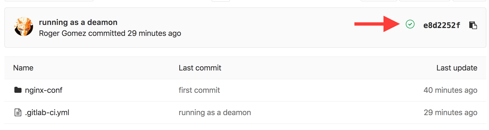
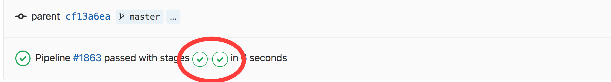

# Why Containers
## Demo0

1. Go to https://gitlab.presidio.com/rgomez/docker-presentation-demo0
2. Click on the red cross or green checkbox. 
3. Click on one of the first green checkbox, that is named **build**. 
4. Scroll down and verify the following steps:
    1. login with the repository: `docker login ...`
    2. a new image was built: `docker build ...`
    3. the image was push to the repository: `docker push ...`
5. Go to the step number 3.
6. Click on the other green checkbox, that is named **test**.
7. Scroll down and verify the following steps:
    1. login with the repository: `docker login ...`
    2. the container is running: `docker run -d -p 8888:80 --name web_demo ...`
    3. a curl was executed to the container: `curl localhost:8888` and got back `HELLO PRESIDIO`
    4. the contair was stopped: `docker stop web_demo`
    5. the container was removed: `docker rm web_demo`
